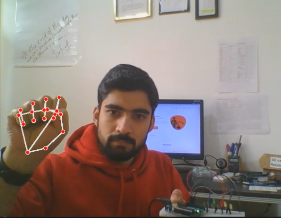

# Hand Gesture Controlled LED System 🌟

 

## Overview
This project is a hand gesture-controlled LED system using Python, OpenCV, and PyFirmata. It allows users to control LEDs by detecting hand gestures through a camera.

## Features
- Real-time hand gesture recognition
- LED control based on the number of fingers detected
- Easy setup with PyFirmata and Arduino

# My Project

Check out the demo video:

<video width="640" height="360" controls>
  <source src="/LED Controller/LED Controller/demo.mp4" type="demo/mp4">
  Your browser does not support the video tag.
</video>

## Requirements
- Python 3.x
- OpenCV (`pip install opencv-python`)
- PyFirmata (`pip install pyfirmata`)
- Arduino Board

## Getting Started

### Step 2: Connect Your Arduino Board
Connect your Arduino board to your computer using a USB cable.

### Step 3: Install Required Python Packages
Open a terminal and install the required Python packages:
`pip install pyfirmata opencv-python`
### Step 4: Upload Arduino Sketch
1. Open the Arduino IDE.
2. Load the Arduino sketch (`led_controller.ino`) located in the project directory.
3. Click "Upload" to upload the sketch to your Arduino board.

### Step 5: Adjust Arduino Port
In the `main.py` file, adjust the `comport` variable to match the port your Arduino is connected to:

`comport = 'COM5' `  # Change this to your Arduino port

### Step 6: Run the Python Script
Run the main Python script in the terminal:

`python main.py`

### Step 7: Control LEDs with Hand Gestures
Hold your hand in front of the camera.
Open different numbers of fingers to control the corresponding LEDs.
### Project Structure
- `led_controller.ino`: Arduino sketch for LED control.
- `main.py`: Python script for hand gesture recognition and LED control.
- `controller.py`: Module for controlling LEDs using PyFirmata.

## Author
Syed Mohsin Bukhari  
- **Email:** smayour82@gmail.com  
- [**Visit Website**](https://mayourbukhari.github.io/Personal-Portfolio)  
- [**LinkedIn**](https://www.linkedin.com/in/syed-mohsin-bukhari/)  
- [**X**](https://twitter.com/ArraySurvey)  
- [**GitHub**](https://github.com/mayourbukhari)  
- [**Instagram**](https://www.instagram.com/mayour_writes)  

## Show Your Support
If you find this project helpful, please consider giving it a star ⭐️ and a fork 🍴.

### License
This project is licensed under the MIT License.

Feel free to contribute, report issues, or suggest improvements! 🚀
    
